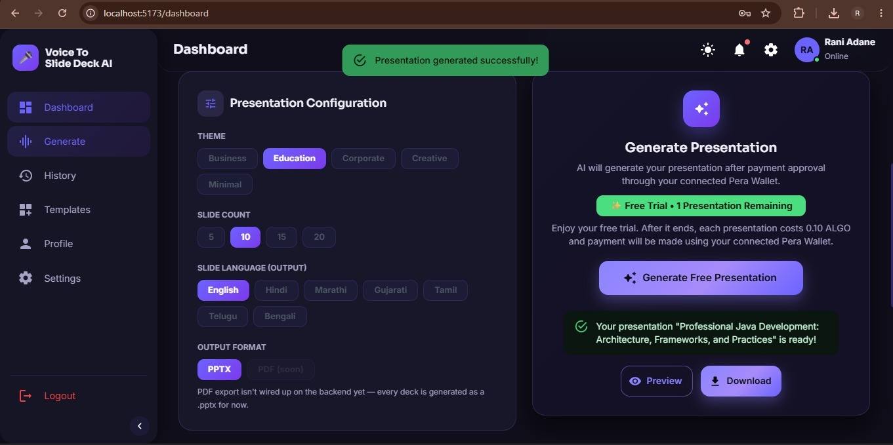

# YASH GATTEWAR

### Computer Engineering Student · Developer · Builder

**I build web applications and experiment with AI-powered ideas.**

<p>
  <a href="YOUR_PORTFOLIO_URL">
    
  </a>
  <a href="https://www.linkedin.com/in/yash-gattewar-0a612a332?utm_source=share_via&utm_content=profile&utm_medium=member_android">
    
  </a>
</p>

---

# PROJECTS

## 🎤 Talk2Slides

### Speech → Content → PowerPoint



A web application I'm building to turn spoken input into structured PowerPoint presentations.

**Built with**

`React` `JavaScript` `Node.js` `Express` `MySQL`

**Worked on**

* Speech-to-text
* React frontend
* Node.js / Express backend
* Database integration
* Translation integration
* PowerPoint generation
* User authentication
* Payment integration

<p>
<a href="YOUR_TALK2SLIDES_REPOSITORY_URL">

</a>
</p>

---

## 🏠 Homeward Estate

### Real Estate Web Experience


A real-estate focused web project built around presenting properties through a clean and modern interface.

**Built with**

`React` `JavaScript` `HTML` `CSS`

**Worked on**

* Property listings
* Property information
* Responsive interface
* Navigation
* Modern UI
* Frontend development

<p>
<a href="YOUR_HOMEWARD_ESTATE_REPOSITORY_URL">

</a>
</p>

---

## 🎬 Movie Recommendation System

### Discover Movies Based on Your Preferences


A movie recommendation project that explores how movie data and recommendation logic can be used to help users discover relevant movies.

**Built with**

`Python` `Machine Learning` `Data Processing`

**Worked on**

* Movie dataset processing
* Recommendation logic
* Movie selection
* Data handling
* Recommendation interface

<p>
<a href="YOUR_MOVIE_RECOMMENDATION_REPOSITORY_URL">

</a>
</p>

---

# TECH STACK

### Frontend

<p>

</p>

### Backend

<p>

</p>

### Database

<p>

</p>

### Tools

<p>

</p>

### Areas I'm Exploring

`Artificial Intelligence` · `Machine Learning` · `NLP` · `Generative AI`

---

# CURRENTLY BUILDING

### 🚀 Building Projects

Working on projects that combine frontend, backend, databases and external services into complete applications.

### 🧠 Exploring AI

Learning how AI and Machine Learning can be applied to practical software problems.

### ⚙️ Improving Development

Working on better coding practices, debugging, APIs and application architecture.

---

# WHAT I ENJOY BUILDING

```text
Web Applications
        │
        ├── Frontend
        │
        ├── Backend
        │
        └── Database

AI-Powered Ideas
        │
        ├── Recommendation Systems
        │
        └── Intelligent Applications

Developer Projects
        │
        ├── Automation
        │
        └── Problem Solving
```

---

# ABOUT ME

I'm a Computer Engineering student who enjoys learning by building.

My practical experience is mainly around **React, JavaScript, Node.js, Express, Python, Flask and MySQL**.

I've worked on projects involving web applications, backend development, databases, recommendation systems, speech processing and application integrations.

I'm currently strengthening my skills in **Data Structures & Algorithms, backend development, AI/ML and software engineering**.

---

# WHAT I'M LEARNING

**DSA**
Improving problem-solving and algorithmic thinking.

**Backend Development**
Going deeper into APIs, authentication, databases and server-side development.

**AI / ML**
Building stronger fundamentals and experimenting with practical applications.

**Software Engineering**
Learning how to design and structure applications more effectively.

---

# HOW I WORK

**Idea → Build → Debug → Improve**

I learn best when I can turn a concept into something working.

---

# LET'S CONNECT

<p>
  <a href="YOUR_PORTFOLIO_URL">
    
  </a>
  <a href="YOUR_LINKEDIN_URL">
    
  </a>
</p>

---

### BUILD · EXPERIMENT · LEARN · IMPROVE

<sub>Yash Gattewar · Computer Engineering</sub>
